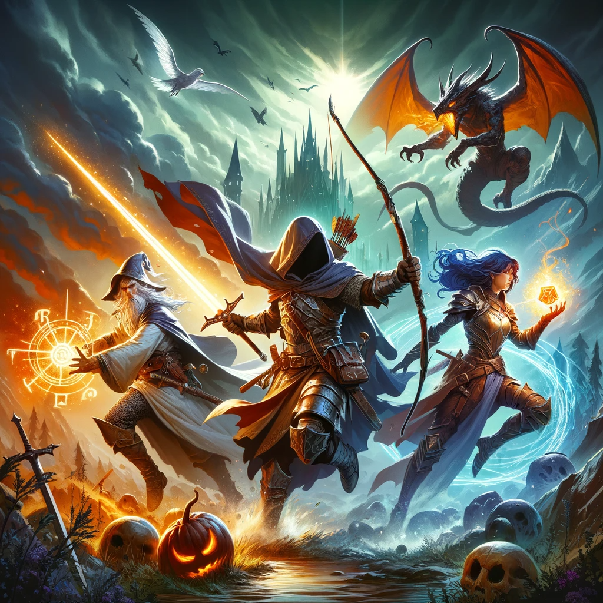

<h1 align="center">Grundlagen der Programmierung</h1>
<h3 align="center">Abschlussaufgabe RPG</h3>
 

  

> **Hinweis**: Lies die Aufgabe aufmerksam. Versuche vor Beginn, die Aufgabe zu strukturieren. Notiere dir skizzenartig/in einem Klassendiagramm, was dein Programm braucht und setze deinen Plan Schritt für Schritt um.

## 1. Szenario

Du bist neuerdings App-Developer und bekommst deinen ersten Auftrag: Du sollst das neue Videospiel „Golden Syntax“ mitentwickeln. Bei diesem Spiel handelt es sich um ein RPG (Rollenspiel) mit Kämpfen gegen NPCs (computergesteuerte Charaktere). In deinem Developer-Team wird dir die Aufgabe zugeteilt, das **rundenbasierte Kampfsystem** zu entwickeln. Danach sollst du dem Team dein Kampfsystem anhand eines Beispielkampfes gegen den Endgegner vorstellen.

## 2. Details

Die Vorlage ist ein leeres Projekt in IntelliJ. Erstelle alle nötigen Dateien: Es gibt eine main.kt, in der das Spiel abläuft. Alle Klassen erhalten jeweils eine eigene Datei. Funktionen kannst du zusammen in eine Datei verlagern.

### Informationen zu den Helden:

* Es gibt ein Team von drei Helden, die gemeinsam als Team in dem Kampf antreten sollen. 
* Die Helden können zum Beispiel _Magier_, _Krieger_ oder Ähnliches sein. Alle Arten von Helden sollen eine eigene Klasse erhalten, die von einer allgemeinen Klasse _Held_ erben.
* Sie alle sollen unterschiedliche Eigenschaften bzw. Werte haben:  \
Einen Namen, HP (Gesundheitspunkte) und vier Aktionen
* Beispiele für Aktionen:  \
Angriffe mit unterschiedlichen Schadenswerten, Heilungsmöglichkeiten, oder Schutzzauber, die einen Helden einmalig vor dem nächsten Angriff schützen.
* Die Heldengruppe hat einen gemeinsamen Beutel. Dieser kann einmalig pro Runde von einer der Helden genutzt werden. Derjenige Held, der den Beutel nutzt, verzichtet also auf seine Aktion.  \
In dem Beutel sind Gegenstände, die einen direkten Effekt auswirken, z.B.: 
    * 3x Heiltrank: heilt einen frei wählbaren Helden um die Hälfte seiner Lebenspunkte
    * 1x Vitamine: erhöhen den Schadenswert für einen Helden dauerhaft um 10%.

### Informationen zum Endgegner:

* Dieser kann beispielsweise ein Dunkler Magier oder ein Drache sein. 
* Auch er hat gewisse Eigenschaften: (Hohe) HP und sechs mögliche Aktionen.
* Besonderheiten zu seinen Aktionen:
    * Eine Aktion (z.B. ein Feueratem) verursacht Flächenschaden. D.h. dass diese Aktion alle Helden gleichzeitig trifft und allen Helden Schaden zufügt. 
    * Eine Aktion ist ein Fluch oder Ähnliches. Dieser soll maximal einen der Helden betreffen und von diesem Helden solange die HP um 10% pro Runde verringern, bis die HP des entsprechenden Helden weniger als 20% seiner gesamten HP beträgt. 
    * Eine andere Aktion bewirkt, dass ein Unterboss (= Helfer) beschworen wird. Auch dieser hat eigene (geringere) HP und vier mögliche Aktionen, um den Endgegner im Kampf zu unterstützen. Wird der Helfer beschworen, muss auch dieser von den Helden besiegt werden, um zu gewinnen.  \
Diese Aktion kann jedoch **maximal einmal pro Kampf** ausgeführt werden! 
* Sowohl der Endgegner als auch der Unterboss sollen eine eigene Klasse erhalten, die von einer allgemeinen Klasse _Gegner_ erben.

### Informationen zum Kampfsystem:

* Es ist rundenbasiert. D.h. die einzelnen Mitglieder deines Heldenteams führen nacheinander eine Aktion aus und danach führt der Endgegner eine Aktion aus. Dies läuft so lange, bis die HP aller einzelnen Teammitglieder **oder** des Endgegner(-teams) auf 0 sinken.
* Nachdem sowohl jeder Held als auch jeder Gegner jeweils eine Aktionen durchgeführt hat, endet die Runde und der Kampf geht in die nächste Runde. 
* Die Aktionen des Gegners werden völlig zufällig aus seinem Pool an möglichen Aktionen ausgewählt.
* Die Aktionen der Helden werden mit einer Eingabe auf der Konsole ausgewählt. \
Das bedeutet, du wirst in der Konsole jede Runde gefragt, welche Aktion du für jeden deiner Helden durchführen möchtest.
* In der Konsole wird außerdem jede Runde geschrieben, welche Aktion der Gegner ausgeführt hat und ggf. wie viele HP die betroffenen Helden / Gegner noch übrig haben. Ziel ist hierbei vor allem, dass man als Nutzer des Programms erfährt, was gerade im Kampf passiert.

## 3. Optionale, freiwillige Ergänzungen und Anmerkungen

Selbstverständlich darfst du dein Spiel mit deinen eigenen Ideen weiter ausschmücken.  \
Einige Ideen zur Erweiterung:

* Du kannst kritische Treffer implementieren.  \
D.h. dass Angriffe mit einer Wahrscheinlichkeit von 5% doppelten Schaden verursachen.
* Wenn du magst, kannst du auch sogenannte „Stats“ bei deinen Helden und Gegnern einfügen. Stats könnten z.B. ein Grundschadenswert, Schnelligkeit (= Reihenfolge, in der die Helden und Gegner ihre Aktionen durchführen), Rüstungswert und ähnliches sein. Der Verteidigungswert könnte z.B. einen Angriff auf den betroffenen Charakter um seinen Wert verringern.
* Noch komplexer wird es, wenn du unterschiedliche Stärken und Schwächen einbinden möchtest. So könnten z.B. deine Helden und Gegner bestimmten Elementartypen angehören. Wasserzauber könnten zum Beispiel gegen Feuertypen grundsätzlich mehr Schaden verursachen – andersherum würde Feuer gegen Wasser nur einen verringerten Schaden verursachen.
